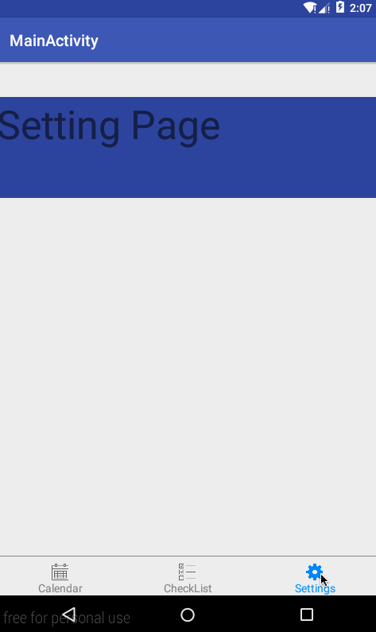

#TabBar
####Tab Bar widget for Android.

#Project Structure
After checkout this repo, you will get a sample project and the TabBar module is located in `tabbar` folder.

#Usage
##Add to layout

		<sun.bob.tabbar.TabBar
            android:layout_width="match_parent"
            android:layout_height="50dp"
            android:id="@+id/id_tabbar" />
##Add tabs
Use below method to add tabs to the bar.

		addTab(int imgId, int highlightImgId, String text, int fontColor, int highlightFontColor)
		
		'imgId' is the resource id for icon's normal state.
		'highlightImgId' is the resource id for icon's checked state.
		'text' is the text under the label
		'fontColor' is text color for normal state.
		'highlightFontColor' is text color for checked state.

##Add OnTabClickedListener
When the tab is clicked, it will call the callback defined in `OnTabClickedListener` with the tab index as argument.

For example,

		class OnClickedListener implements OnTabClickedListener{
			@Override
			 public void onTabCliked(int index) {
			 MainActivity that = MainActivity.this;
			that.getSupportFragmentManager().beginTransaction().hide(currentFragment).show(fragments.get(index)).commit();
			currentFragment = fragments.get(index);
			}
		}

#License
Copyright 2015 Bob Sun

Licensed under the Apache License, Version 2.0 (the "License"); you may not use this file except in compliance with the License. You may obtain a copy of the License at

http://www.apache.org/licenses/LICENSE-2.0
Unless required by applicable law or agreed to in writing, software distributed under the License is distributed on an "AS IS" BASIS, WITHOUT WARRANTIES OR CONDITIONS OF ANY KIND, either express or implied. See the License for the specific language governing permissions and limitations under the License.

See LICENSE file for details

####Icons from [icons8.com](http://icons8.com)
